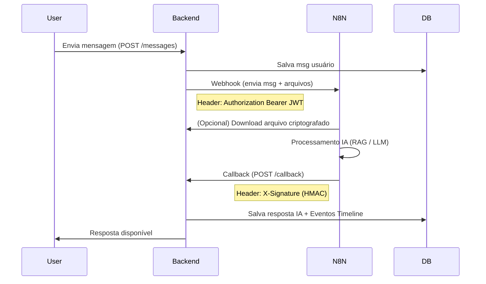

# 🤖 Integração N8N e IA

O Backend se integra com workflows do N8N para prover funcionalidades de Agente de IA, processamento de documentos e geração de timelines.

## Arquitetura de Integração

A comunicação é **bidirecional e assíncrona**.



## Configuração do N8N

### Variáveis de Ambiente Necessárias
No `.env` do Backend:
```env
N8N_WEBHOOK_URL=https://seu-n8n.com/webhook/...
N8N_JWT_TOKEN=<token_gerado_para_o_n8n>
N8N_SIGNING_SECRET=<segredo_compartilhado_hex>
```

### Workflows (Templates)
Os workflows JSON devem ser importados no N8N:
1.  **Orchestrator**: Recebe o webhook, decide qual "tool" usar.
2.  **Document Processor**: Baixa arquivos, faz OCR/Vetorização.
3.  **Timeline Updater**: Gera eventos de progresso na timeline do processo.

## Segurança da Integração

1.  **Autenticação Backend -> N8N**: O Backend envia um JWT. O N8N deve validar esse token (ou simplesmente confiar na URL secreta do webhook se estiver em rede interna segura, mas JWT é recomendado).
2.  **Autenticação N8N -> Backend (Callback)**:
    *   O Backend exige headers `X-Timestamp` e `X-Signature`.
    *   A assinatura é um HMAC-SHA256 do corpo `timestamp + payload` usando a `N8N_SIGNING_SECRET`.

## Endpoints de Callback

O N8N utiliza o endpoint:
`POST /api/chat/threads/{thread_id}/messages/callback`

Payload esperado do N8N:
```json
{
  "assistant_message": "Texto da resposta da IA...",
  "timeline_events": [
    {
      "type": "stage",
      "status": "completed",
      "title": "Análise Concluída",
      "description": "Documentos validados com sucesso."
    }
  ],
  "metadata": { "model": "gpt-4", "tokens": 150 }
}
```
